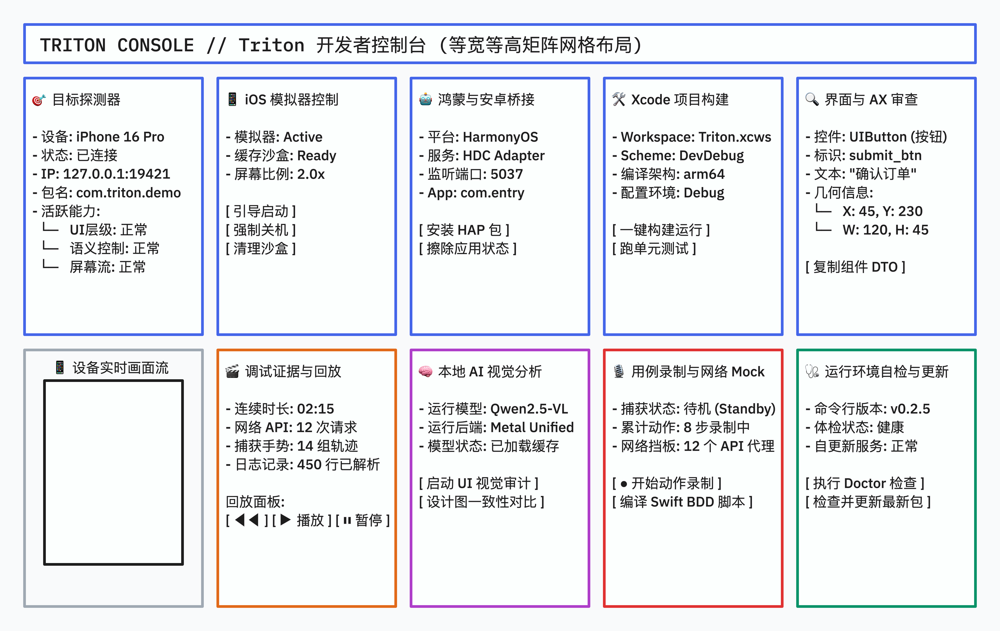

# Space: Web 重新设计 (等宽等高卡片矩阵)

## 1. 背景与目标
TritonKit 目前的 Web 控制台仅包含简单的 Mock 页面。为了提供直观、模块化的控制面板，我们将重构整个前端。
本次重构采用现代 **Bento Grid（便当盒网格布局）** 理念，废弃传统的侧边栏，将 TritonKit 的 10 大核心能力封装为 10 个等宽等高（`232px` * `335px`）的独立卡片容器，并按 `2 行 5 列` 的矩阵布局整齐平铺在桌面上。

## 2. 功能范围 (10 大等大能力卡片)

### 第一行 (Row 1)
1. **🎯 目标探测器 (Target Explorer)**：展示探测到的活跃设备（iOS模拟器、鸿蒙/安卓仿真器）及已连接端口与 Runtime 状态。
2. **📱 iOS 模拟器控制 (Simulator Control)**：提供一键启动、关机与沙盒数据擦除操作。
3. **🤖 鸿蒙与安卓桥接 (HDC/ADB Bridge)**：管理 DevEco / Android 仿真器的包安装与沙盒状态。
4. **🛠 Xcode 项目构建 (Xcode Workflow)**：支持对宿主工程进行编译、部署与单元测试触发。
5. **🔍 界面与 AX 审查 (Inspector & AX)**：查看当前的视图层级、AX（无障碍）节点树以及选中元素的几何坐标。

### 第二行 (Row 2)
6. **📱 设备实时画面流 (Device Screen Stream)**：内嵌微缩的设备屏幕外壳，作为核心交互区域。
7. **🎬 调试证据与回放 (Evidence & Replay)**：提供 02:15 证据包的回放进度控制及事件分类统计。
8. **🧠 本地 AI 视觉分析 (Local VLM)**：集成 mlx-swift-lm，一键拉取本地 Qwen模型进行视觉审计与设计稿对比。
9. **🎙 用例录制与网络 Mock (Test Recorder)**：实时记录用户输入动作流，自动保存 API 请求 Fixtures 并转译生成 Swift BDD 脚本。
10. **🩺 运行环境自检与更新 (Doctor & Update)**：一键执行 `triton doctor` 并检测 CLI 及技能包升级。

---

## 3. 设计原型 (Baseline Mockup)
我们在本地 `http://localhost:3031/` 上实时同步并渲染了这套网格布局：

---

## 4. 验收标准 (DoD)
1. **工程初始化**：旧 Mock 项目清理干净，建立全新的 CSS 样式体系和 React 根架构。
2. **布局规整性**：10 张卡片完全等宽等高，行、列排布紧凑，在主流开发屏幕尺寸下实现完美的响应式居中。
3. **状态连通**：每个卡片容器实现组件解耦，作为独立的 React Component，预备后续与 CLI/HTTP API 的对接。
4. **测试自检**：通过基本的 lint 门禁，前端打包构建（npm run build）成功无错。
