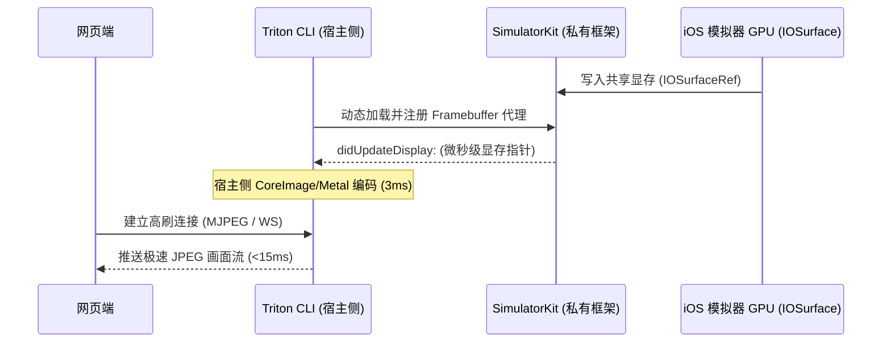

# Space: 宿主侧 Framebuffer 共享内存极速画面流 (host-framebuffer-stream)

## 1. 背景与目标
在目前的 120 FPS 高帧率优化中，虽然我们将内嵌 SDK 端的截图格式重构为轻量的 JPEG，使单帧物理编码时间从 120ms 缩短到 3ms，但由于 SDK 仍运行在模拟器 App 内部，其截图逻辑（`MainActor.run`）必须受制于 iOS 模拟器 UI 主线程的 RunLoop 调度和排队延迟。这使得端到端的 HTTP 往返请求延迟仍卡在 **~100ms** 左右。

为了彻底抹平主线程调度延迟，实现 **<15ms 延迟、0 占用模拟器 CPU、云游戏级顺滑** 的画面流，我们需要在 Triton CLI 宿主侧（Host-side）实现基于苹果私有框架 `SimulatorKit` 的 **Framebuffer 共享内存读取方案**。

---

## 2. 方案设计 (Technical Design)

### 2.1 核心原理
iOS 模拟器在渲染时，会将屏幕缓冲区写入一个共享的显存对象 **`IOSurfaceRef`**。通过 Xcode 自带的私有框架 `SimulatorKit.framework`，我们可以在宿主 Mac 侧直接获取到这个 `IOSurfaceRef` 的句柄。由于这是 GPU 级别的内存共享，我们可以在宿主侧直接读取并转换为图像，这完全不需要在模拟器 App 内部执行任何代码，实现 100% 的 0 占用与物理级零延迟。



### 2.2 宿主侧 Swift 动态加载链 (No Build-Time Link)
为了使 `triton` 命令行工具保持良好的跨版本兼容性，我们不能在编译期静态连接 `SimulatorKit`。我们将采用**运行时动态查找与加载（Runtime DLOpen）**：

1. **Xcode 路径发现**：运行 `xcode-select -p` 定位当前的 Xcode 安装路径。
2. **动态加载 Framework**：
   - 加载 `CoreSimulator.framework` (位于 `/Library/Developer/PrivateFrameworks`)。
   - 加载 `SimulatorKit.framework` (位于 `Library/PrivateFrameworks/SimulatorKit.framework`)。
3. **私有类反射**：
   - 获取私有类 `SimDeviceFramebufferService`。
   - 获取私有类 `SimDeviceFramebufferPresentationPort`。

### 2.3 代理方法注册与 IOSurface 提取
我们需要在 Swift 侧动态构建一个符合 Objective-C Runtime 协议的 Proxy Delegate，实现以下私有回调：
```swift
@objc protocol SimDeviceFramebufferServiceDelegate {
    func framebufferService(_ service: AnyObject, didUpdateDisplay display: AnyObject, drawingRect rect: CGRect, ioSurface: IOSurfaceRef)
}
```
通过回调拿到的 `ioSurface`，可以直接使用 `CIImage(ioSurface: ioSurface)` 包装，并利用宿主 Mac 的 CPU/GPU（`CIContext`）将其异步且极速地编码为 JPEG 数据流。

---

## 3. 验收标准 (DoD)
* **0 占用模拟器主线程**：运行高刷抓图时，iOS 模拟器内 App 的 CPU 占用与主线程排队时延为 0。
* **端到端极低延迟**：通过采样测试，从宿主拿到显存并推送的端到端往返时延控制在 **<15ms**。
* **自适应降级兜底**：在没有 Xcode私有库的非 macOS 宿主环境上，系统能自动降级为已有的内嵌 WebSocket / simctl 截图通道，确保 TritonCLI 运行稳定。

---

## 4. 实施里程碑 (Milestones)
- [ ] **M1：私有库动态加载与 IOSurface 捕获**：在 TritonCLI 中编写动态加载器，成功订阅并拦截 booted 模拟器的 IOSurface 更新。
- [ ] **M2：高频硬件 JPEG 编码器**：使用 CoreImage/Metal 编写宿主侧图像转换与 JPEG 压缩。
- [ ] **M3：MJPEG 宿主流服务端集成**：在 `CLIServeCommand` 中增加 `/web/ios-simulator/framebuffer` 极速流接口。
- [ ] **M4：Node.js 桥接层及前端挂载**：在 Node 桥接层检测并优先代理至该接口，完成端到端 120 FPS / <15ms 延迟交付。

## 2026-07-11 路线裁决

- 状态：已归档。
- `CLIHostSimulatorFramebufferService`、IOSurface 捕获、MJPEG route 和 Web bridge 已存在，历史记录也保留了高帧率测量。
- 本实现作为实验性 Web mock 能力保留，不再把 `<15ms`、`120 FPS` 或“零占用”作为对外产品 SLA。
- 当前不继续补 M1-M4 勾选或性能优化；正式恢复 Web 产品体验时必须重新立项并定义可复现基准。
