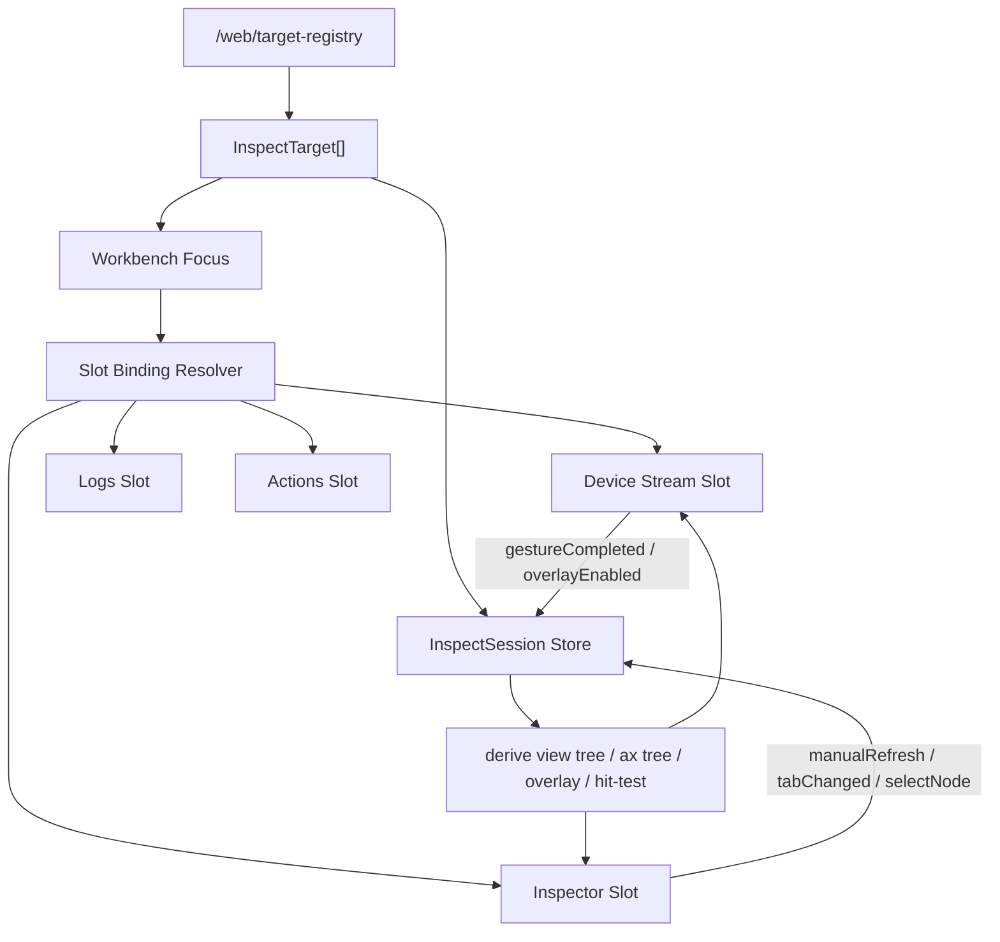

# Space: 20260706 Web Inspect Session Slots

## 背景

Web mock 当前已经有插槽式工作台、设备实时画面流、界面与 AX 审查、View / AX overlay、手势映射和 target registry。但这些能力仍然分散在组件状态里：

- `StreamCard` 掌握真实 target descriptor，包括 `platform`、`scope`、`kind`、`source`、`targetSelector` 和输入能力。
- `InspectorCard` 通过 `activeStreams` 自己推断当前设备，并单独刷新 hierarchy。
- hierarchy 数据仍按 `udid` 存在全局 `hierarchyScenes`，而不是按稳定 target/session 归属。
- `selectedNodeId` / `hoveredNodeId` 是全局单值，多设备、多 Inspector 或 pinned slot 时会互相抢状态。
- View tree、AX tree、overlay nodes 和 hit-test 的派生逻辑散在 `StreamCard`、`InspectorCard`、`hierarchyVisibility` 里。

用户反馈 iOS 的视图树 / AX 树选不到 cell，排查方向确认：这不只是 cell hit-test 问题，根因之一是“界面与 AX 审查”没有跟着设备画面流刷新，同一个目标可能被两个插槽用不同 source / refresh 时机处理。需要把插槽设计升级为整体 Inspect Session 架构，而不是只补一个最小联动。

2026-07-06 产品形态补充：当前 Web mock 不再保留十宫格能力卡片。工作台只保留 `stream` 和 `inspector` 两类插槽，其他 Xcode、VLM、目标探测、时间线、doctor、模拟器、录制、HDC/ADB 卡片入口从插槽选择中移除，避免 Web mock 表达成错误的产品控制台形态。

## 核心目标

建立 Web mock 的统一审查状态模型：

- 插槽仍然保留，但插槽只管布局和展示，不拥有设备事实。
- Target registry 产出的 target descriptor 是设备身份的唯一事实。
- Inspect Session 是 hierarchy、overlay、节点选中、刷新状态的唯一事实源。
- Stream slot、Inspector slot 通过 Slot Binding 绑定到同一个 Inspect Session。
- View tree / AX tree / overlay / hit-test 都从同一份 `HierarchyScene.nodes` 派生。
- iOS simulator / iOS real-device / Android / Harmony 的 hierarchy source 差异在 target/session 层抹平，组件不再自己猜。

一句话边界：

```text
Slot 是布局单位，Binding 是跟随规则，Target 是设备身份，Session 是事实源，Derive 是展示投影。
```

## 非目标

- 不把 Web mock 升级成正式业务控制入口。
- 不新增 Web 侧低层设备控制后端。
- 不在本期实现新的平台采集能力。
- 不引入 Redux / Zustand 等新依赖；优先使用现有 React Context + reducer。
- 不把 Android / Harmony 伪装成独立 View / AX 双树。
- 不通过截图像素推断 cell、焦点、可点击性或业务状态。

## 术语

### Slot Shell

插槽 UI 容器，只负责工作台布局与面板生命周期：

```ts
type SlotShell = {
  slotId: string;
  slotType: "stream" | "inspector" | "logs" | "network" | "actions";
  title: string;
  layoutRect: unknown;
  focused: boolean;
  collapsed: boolean;
  pinned: boolean;
};
```

Slot Shell 不直接 fetch hierarchy，不知道 `source=host|runtime`，也不保存节点选中。

### Slot Binding

插槽如何绑定设备/session：

```ts
type SlotBinding =
  | { mode: "followWorkbenchFocus" }
  | { mode: "followSlot"; slotId: string }
  | { mode: "pinnedTarget"; targetKey: string };
```

默认规则：

- Stream slot 选择 target 后写入 workbench focus。
- Inspector / Logs / Actions 默认 `followWorkbenchFocus`。
- 对比调试时，Inspector 可以 `followSlot(streamSlotId)`。
- 固定排查时，Inspector 可以 `pinnedTarget(targetKey)`。

### Inspect Target

从 `/web/target-registry` 归一化得到：

```ts
type InspectTarget = {
  key: string;
  platform: "ios" | "android" | "harmony";
  target: string;
  scope?: "simulator" | "emulator" | "real";
  kind?: string;
  screenshotSource?: "host" | "runtime";
  hierarchySource?: "host" | "runtime";
  inputCapabilities: WebInputCapability[];
};
```

要求：

- `targetKey` 必须稳定，可作为 Map key；不要靠 split 反解析 key，真实字段保留在对象内。
- iOS simulator 默认 `hierarchySource=host`。
- iOS real-device 默认 `hierarchySource=runtime`。
- Android / Harmony 不强行设置 AX / View 双源。

### Inspect Session

每个 target 对应一个审查 session：

```ts
type InspectSession = {
  targetKey: string;
  scene?: HierarchyScene;
  selectedNodeId?: string | null;
  hoveredNodeId?: string | null;
  overlayMode: "none" | "view" | "ax";
  loading: boolean;
  error?: string;
  stale: boolean;
  updatedAt?: number;
  requestSeq: number;
};
```

Session 生命周期和插槽生命周期分离。关闭 Inspector 不清 hierarchy；关闭 Stream 也不必立即清 session，因为其他 pinned slot 可能还在用。

## 状态归属

```text
Slot Shell
- slotId
- slotType
- layout
- focused
- collapsed
- pinned UI state

Slot Binding
- binding mode
- pinned targetKey
- follow slotId

Target Registry
- targets[]
- targetKey
- platform/scope/kind/source/capabilities

Inspect Session
- scene
- selectedNodeId
- hoveredNodeId
- overlayMode
- loading/error/stale/updatedAt/requestSeq

Component Local State
- Inspector simplify checkbox
- details modal open
- transient pointer session
- FPS
- dropdown open/closed
```

`selectedNodeId` / `hoveredNodeId` 必须进入 `InspectSession`，不能继续作为全局单值。

## 数据流



插槽之间不直接互调：

```text
Stream Slot -> setFocusedTarget(targetKey)
Stream Slot -> refreshInspectSession(targetKey, "gestureCompleted")
Inspector Slot -> useBoundInspectSession(slotId)
Inspector Slot -> selectNode(targetKey, nodeId)
```

禁止：

```text
StreamCard -> InspectorCard.refresh()
InspectorCard -> 读取 StreamCard 私有 state
InspectorCard -> 自己拼 /web/host-hierarchy query
```

## 刷新规则

统一入口：

```ts
refreshInspectSession(targetKey: string, reason: RefreshReason): Promise<void>
```

`RefreshReason`：

- `targetChanged`
- `overlayEnabled`
- `manualRefresh`
- `gestureCompleted`
- `streamReconnect`

规则：

- `targetChanged`：刷新当前 target。
- `overlayEnabled`：缺失或 stale 时刷新。
- `manualRefresh`：强制刷新。
- `gestureCompleted`：输入成功后刷新 hierarchy。
- `streamReconnect`：缺失或 stale 时刷新。
- View / AX tab 切换：不发网络请求，只重新派生。

防竞态：

```text
sessionRefreshStarted -> requestSeq + 1
sessionRefreshSucceeded/Failed -> 只有 seq 等于当前 requestSeq 才能写入
```

解决快速切设备、连续刷新、手势后又切 target、慢请求覆盖新 session。

## 派生模型

新增统一派生层：

```text
inspect/hierarchyDerive.ts
- deriveViewTree(nodes, options)
- deriveAxTree(nodes)
- deriveOverlayNodes(nodes, overlayMode)
- findSelectedNode(nodes, selectedNodeId)
```

### View tree 简化规则

只折叠明确纯噪声容器：

```text
UIView
UITransitionView
UIDropShadowView
UILayoutContainerView
UIViewControllerWrapperView
WKCompositingView
WKScrollView
WKContentView
```

必须保留：

- `Cell` / `UITableViewCell` / `UICollectionViewCell` / `AXCell` 等 cell-like 节点。
- interactive 节点。
- 有 `accessibilityIdentifier` 的节点。
- 有 `accessibilityLabel` 或文本的节点。

### AX tree 派生规则

不要只用“有文本 / identifier / interactive”判断。iOS cell 可能是 AX grouping container，文本在子节点。

AX 派生：

- 自身有 AX 信息：保留。
- interactive：保留。
- cell-like 且有 AX descendant：保留为 grouping node。
- 否则 lift children。

### Hit Test

统一到：

```ts
hitTestHierarchyNode({
  nodes,
  mode,
  point,
  selectedNodeId,
});
```

规则：

1. 只在当前 overlay mode 对应节点集里命中。
2. 排除不可见节点。
3. 排除 `width <= 0` 或 `height <= 0` 节点。
4. 如果点击点仍在当前 selected node 内，优先选 selected node 的后代。
5. 否则选最小面积。
6. 面积相同时选 depth 更深。
7. 后续如需要同面积兄弟循环，再显式加 cycle 规则和 UI 提示。

返回：

```ts
type HitTestResult = {
  nodeId: string | null;
  reason: "deepest" | "selected-descendant" | "none";
  candidates: string[];
};
```

## 插槽行为

### Stream Slot

保留：

- FPS。
- pointer gesture session。
- image layout。
- gesture dispatch。
- target dropdown。

改为：

- target 切换后调用 `setFocusedTarget(targetKey, slotId)`。
- overlay 切换后写 `session.overlayMode`。
- overlay 打开时调用 `refreshInspectSession(..., "overlayEnabled")`。
- 手势成功后调用 `refreshInspectSession(..., "gestureCompleted")`。
- overlay nodes 来自 `deriveOverlayNodes(session.scene, session.overlayMode)`。
- overlay 点击走 `hitTestHierarchyNode`，再写 `selectNode(targetKey, nodeId)`。

删除：

- 本地 hierarchy source 推断。
- 本地 `fetchHierarchy` options 拼接。
- 本地 AX 节点过滤逻辑。

### Inspector Slot

保留：

- simplify UI。
- details modal。
- tree expanded state。
- visible details rendering。

改为：

- `target = resolveSlotTarget(slotId)`。
- `session = getSession(target.key)`。
- tree 来自 `deriveViewTree` / `deriveAxTree`。
- 刷新按钮调用 `refreshInspectSession(target.key, "manualRefresh")`。
- tab 切换写 `session.overlayMode = "view" | "ax"`，Stream overlay 跟着变。
- tree select 写 `selectNode(target.key, nodeId)`。
- 如果刷新后旧 `selectedNodeId` 不存在，清空当前 session 的选中。

删除：

- `selectedUdid`。
- `activeStreams` 距离推断。
- `globalFetchHierarchy(currentStream.udid, currentStream.platform)`。
- 内联 AX filter / View simplify。

## BDD 场景

### iOS simulator source 一致

Given target registry 返回一个 iOS simulator target，`hierarchySource=host`
When Stream slot 打开 view overlay
Then refresh 请求必须带 `source=host`
And Inspector slot 显示同一个 session 的 View tree

### iOS real-device source 一致

Given target registry 返回一个 iOS real-device target，`hierarchySource=runtime`
When Inspector slot 点击刷新
Then refresh 请求必须带 `source=runtime`
And 不 fallback 到 simulator runtime target

### 手势后 Inspector 自动刷新

Given Stream slot 已连接 target 且 Inspector slot 跟随 workbench focus
When 用户在设备画面完成一次成功 tap
Then Stream slot 触发 `refreshInspectSession("gestureCompleted")`
And Inspector slot 更新时间变化
And tree 使用刷新后的 scene

### View / AX tab 与 overlay 双向同步

Given Inspector slot 绑定当前 target
When 用户点击 Inspector 的 AX 树 tab
Then session overlay mode 变成 `ax`
And Stream slot overlay 同步为 AX

### 多设备下选中隔离

Given 两个 Stream slot 分别绑定 target A / target B
When 用户在 target A 上选中 node A1
And 用户切到 target B 并选中 node B1
Then target A session 仍保留 A1
And target B session 只显示 B1

### pinned Inspector 不跟随焦点

Given Inspector slot 已 pinned 到 target A
When workbench focus 切换到 target B
Then Inspector slot 仍显示 target A 的 session

### cell 保留与命中

Given scene 中存在 `UITableViewCell`，cell 自身没有 AX 文本，但其子节点有 AX 文本
When 派生 AX tree
Then cell grouping node 被保留
And 点击 cell 区域时，hit-test 能返回 cell 或其最小可命中 AX 子节点

### 旧请求不覆盖新 session

Given target A refresh 请求仍在飞行
When 用户切换到 target B 并完成 B 的 refresh
And target A 的旧请求随后返回
Then target B session 不被覆盖
And target A 结果只能写回 target A 对应 session

## 测试门禁

单元测试：

- `inspectTarget.test`
  - iOS simulator target key/source。
  - iOS real-device target key/source。
  - Android / Harmony 不伪造 View / AX 双源。
- `inspectSessionStore.test`
  - refresh 使用 descriptor source。
  - stale request 不能覆盖当前 session。
  - selected node 按 target 隔离。
  - pinned target 不跟随 focus。
- `hierarchyDerive.test`
  - View simplify 保留 `UITableViewCell`。
  - AX derive 在 descendant 有 AX 时保留 cell grouping。
  - noise container 单子节点折叠。
- `hitTest.test`
  - 选中最小 cell 子节点。
  - selected ancestor 二次点击下钻。
  - `mode=ax` 只命中 AX-derived nodes。

验证命令：

```bash
cd Web && npm test
cd Web && npm run build
docs-linhay/scripts/check-docs.sh
git diff --check
```

浏览器 smoke：

1. 启动 Web：`TRITONKIT_TRITON_BIN=<repo>/.build/cli/debug/triton npm run dev -- --host 127.0.0.1`。
2. 打开 `http://127.0.0.1:34127/`。
3. 选择 iOS simulator。
4. 打开 view overlay。
5. 点击 cell 区域。
6. Inspector 同步选中同一节点。
7. 切 AX 树，Stream overlay 同步切 AX。
8. 再点 cell 内子区域，选到对应 AX 子节点。
9. gesture 成功后 Inspector 更新时间变化。
10. console 无 error/warn。

## 落地边界

本 space 后续代码落地建议拆为一个整体 PR，但按阶段提交：

1. Target / session / binding 模型与单测。
2. hierarchy derive / hit-test 模型与单测。
3. StreamCard 接入 session store。
4. InspectorCard 接入 session store。
5. Browser smoke 和文档收尾。

不先做“只把 Inspector fetch options 补上”的最小修复；那会继续保留组件各自拥有事实的结构。

## 2026-07-06 落地记录

- 已新增 `Web/src/inspect/` 纯模型层：
  - `target.ts`：从 Web `DeviceTarget` 归一化 `InspectTarget`，稳定生成 target key，并把 iOS simulator / real-device 的 hierarchy source 固化在 target descriptor。
  - `sessionStore.ts`：管理 target、slot binding、focused target、per-target session、overlay mode、selected / hovered node、requestSeq 防竞态。
  - `hierarchyQuery.ts`：唯一 hierarchy query 构造入口。
  - `hierarchyDerive.ts`：统一 View tree、AX tree、overlay nodes、selected node 派生；保留 cell-like grouping node。
  - `hitTest.ts`：统一 overlay hit-test，支持 selected ancestor 下钻。
- `AppContext` 已接入 inspect session store，同时保留旧 API 兼容既有测试和其它卡片。
- `StreamCard` 已改为：
  - target registry 结果写入全局 InspectTarget/session store。
  - target 选择写 workbench focus。
  - overlay mode 写 per-target session。
  - overlay nodes / hit-test 由 inspect 派生层提供。
  - gesture 成功后调用 `refreshInspectSession(..., "gestureCompleted")`。
- `InspectorCard` 已改为：
  - 通过 slot id 解析当前 InspectTarget，不再按 activeStreams 距离推断。
  - 树和节点详情全部从当前 target 的 session scene 派生。
  - 手动刷新走 `refreshInspectSession(..., "manualRefresh")`。
  - View / AX tab 切换同步更新 Stream overlay mode。
  - 顶部增加“跟随 / 固定”绑定控制；默认跟随 workbench focus，固定时绑定当前 target。
- 新增 `Web/dev/inspectModel.test.mjs` 并纳入 `npm test`，覆盖：
  - iOS simulator / real-device hierarchy source。
  - stale request 不覆盖最新 session。
  - pinned slot 不跟随 workbench focus。
  - selected node 按 target session 隔离。
  - View / AX 派生保留 cell grouping。
  - AX overlay hit-test 支持 selected ancestor 下钻。
- 浏览器 smoke：
  - 使用本仓 `.build/cli/debug/triton` 启动 `http://127.0.0.1:34127/`。
  - 页面 `LIVE`、`界面与 AX 审查`、`视图树`、`AX 树` 正常显示，无横向溢出。
  - Inspector 顶部显示“跟随”绑定控制。
  - 点击 Inspector `AX 树` tab 后，Stream overlay radio 同步为 `AX`。
  - 点击设备画面 overlay 后，Inspector 同步显示选中节点详情与 `查看更多信息`。
  - 修复过程中发现并处理一个 React maximum update depth 问题：Inspector 空 scene 使用稳定空数组，避免 effect 反复 setState。
  - 新操作后的 console 无 error/warn。
  - 截图：`screenshots/20260706-web-inspect-session-slots-browser-smoke-after-v01.png`（本地验收产物，当前被仓库级 `screenshots/` ignore 规则忽略）。
- Inspector 选中节点详情已从底部信息块改为 Lookin-like modal property sheet：
  - 顶部只保留轻量 `选中:` chip、`详情` 和 `复制`。
  - modal 左侧显示节点 class/name/id/parent/source/status/frame 摘要。
  - modal 右侧按 `Geometry`、`View`、`Layer`、`AX`、`Raw` 分区查看和编辑草稿字段。
  - 已补 runtime 节点属性写入契约：Shared `TKNodePropertyPatchRequest/Response` 作为 CLI/HTTP/Web 共用 DTO，`triton debug patch-node` 与 `triton serve /web/node-property` 都走 `modifyAttribute` 下发到 embedded runtime。
  - runtime 端按白名单写入 iOS UIKit / CALayer 属性：frame、view hidden/alpha/userInteraction/AX identifier/label、layer hidden/masksToBounds/opacity/cornerRadius/zPosition，以及常见文本控件 text / foregroundColor / backgroundColor；不支持项进入 `skipped`。
  - Web bridge 只支持 iOS runtime 属性写入：iOS host/simulator target 先解析匹配的 App runtime target 后转发，Android / Harmony 返回 `web_node_property_platform_not_supported`，避免伪装成跨端属性反向修改。
  - 浏览器 smoke 使用 iOS runtime tree 选中 `iDxyer.MTLFormCell`，打开 modal 后确认 Geometry 输入值和禁用应用按钮正常，无 console error/warn。
  - 真实 Demo 属性应用 smoke 使用 `TritonKit Dedicated iPhone 17` 上的 `com.neptunekit.tritonkit.demo`，对 `ComplexHarnessStatus` / `ios-runtime:130` 写入 `view.accessibilityLabel`：`/web/node-property`、`triton debug patch-node` 和 Vite bridge `127.0.0.1:34127/web/node-property` 均返回 `ok=true` 与 `applied:["view.accessibilityLabel"]`；`triton observe tree` 回读命中 smoke 文本，最后恢复为 `Complex harness: 0`。
  - smoke 暴露同一 Simulator 上多个 App runtime 生成相同 `triton:ios-simulator:<udid>` target id 的问题；本轮已改为 bundle-scoped id，例如 `triton:ios-simulator:<udid>/app:com.neptunekit.tritonkit.demo`，旧 UDID / unscoped selector 在多 runtime 时返回 `ambiguous_target`，Vite bridge 同样拒绝 ambiguous simulator runtime mirror。
  - 截图：`screenshots/20260706/20260706-web-inspector-property-sheet-after-01.png`。
- 验证通过：
  - `swift test --filter TKCLITransportModelsTests/nodePropertyPatchRequestResolvesOid`
  - `swift test --filter TKNodePropertyPatchTests`（macOS 上 UIKit case 被 `#if canImport(UIKit)` 跳过）
  - `cd Web && node --test dev/ios-bridge/nodePropertyRoute.test.mjs dev/nodePropertyDraft.test.mjs`
  - `CLI/.build/debug/triton debug --help | rg "patch-node|Patch"`
  - `CLI/.build/debug/triton schema --command debug --json | rg "patch-node|node.propertyPatch|TKNodePropertyPatchResponse"`
  - `CLI/.build/debug/triton app launch --bundle-id com.neptunekit.tritonkit.demo --simulator 0333546D-2AC6-4C22-AF01-293E2F4BA5BC --json`
  - `curl -X POST http://127.0.0.1:19421/web/node-property?...`
  - `curl -X POST http://127.0.0.1:34127/web/node-property?...`
  - `CLI/.build/debug/triton observe tree --target triton:ios-simulator:0333546D-2AC6-4C22-AF01-293E2F4BA5BC/app:com.neptunekit.tritonkit.demo --json`
  - `CLI/.build/debug/triton observe tree --target triton:ios-simulator:0333546D-2AC6-4C22-AF01-293E2F4BA5BC --json`（多 runtime 时预期 `ambiguous_target`）
  - `swift test --package-path CLI --filter SchemaFactSourceTests/observeAndNodeProvidedCapabilitiesStaySchemaMatrixAligned`
  - `cd Web && npm test`
  - `cd Web && npm run build`
  - `docs-linhay/scripts/check-docs.sh && git diff --check`
